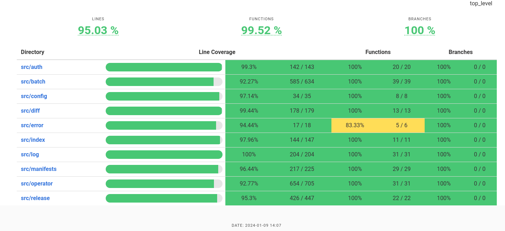

## Overview


This is a simple POC that mirrors ocp/okd release, operator and additional images in dockerv2 format (from a registry) to disk 
and from disk to mirror

## POC 

This is still a WIP. It will use the head of the defaultChannel (for operators) 
and specific release version only (for platform/release images)

I used a simple approach - Occam's razor

- A scientific and philosophical rule that entities should not be multiplied unnecessarily (KISS)
- Worked with a v2 images for the POC
- only operators have been included for now
- release and additional images are not implemented yet

## Usage

Clone this repo

Ensure that you have the correct permissions set in the $XDG_RUNTIME_DIR/containers/auth.json file

Execute the following to copy to local disk 

```bash
mkdir -p working-dir/rhopi/blobs/sha256
cargo build 

# create an ImageSetConfig (this uses the example in this repo)
kind: ImageSetConfiguration
apiVersion: alpha1
mirror:
  operators:
  - catalog: "registry.redhat.io/redhat/redhat-operator-index:v4.13"
    packages:
    - name: aws-load-balancer-operator


# execute 
cargo run -- --config imagesetconfig.yaml 
```

Console output

```
cargo run -- --config imagesetconfig.yaml 
   Compiling rust-image-mirror v0.1.0 (/home/lzuccarelli/Projects/rust-image-mirror)
    Finished dev [unoptimized + debuginfo] target(s) in 3.71s
     Running `target/debug/rust-image-mirror --config imagesetconfig.yaml`
 INFO   : rust-image-mirror imagesetconfig.yaml 
 DEBUG  : Some(
    [
        Operator {
            catalog: "registry.redhat.io/redhat/redhat-operator-index:v4.13",
            packages: Some(
                [
                    Package {
                        name: "aws-load-balancer-operator",
                        channels: None,
                    },
                ],
            ),
        },
    ],
)
 INFO   : operatore collector mode: mirrorToDisk
 DEBUG  : image reference "registry.redhat.io/redhat/redhat-operator-index:v4.13"
 DEBUG  : Image refs [
    ImageReference {
        registry: "registry.redhat.io",
        namespace: "redhat",
        name: "redhat-operator-index",
        version: "v4.13",
        packages: [
            "aws-load-balancer-operator",
        ],
    },
]
 INFO   : downloading blobs...
 INFO   : completed image index download
 DEBUG  : cache exists working-dir/redhat-operator-index/v4.13/cache/cf7a10
 DEBUG  : cache exists working-dir/redhat-operator-index/v4.13/cache/a3ed95
 DEBUG  : cache exists working-dir/redhat-operator-index/v4.13/cache/0b3120
 DEBUG  : cache exists working-dir/redhat-operator-index/v4.13/cache/136093
 DEBUG  : cache exists working-dir/redhat-operator-index/v4.13/cache/60db51
 DEBUG  : cache exists working-dir/redhat-operator-index/v4.13/cache/766eb4
 DEBUG  : cache exists working-dir/redhat-operator-index/v4.13/cache/93809c
 INFO   : completed untar of layers 
 INFO   : full path for directory 'configs' working-dir/redhat-operator-index/v4.13/cache/a91987/configs  
 INFO   : default channel Some("stable-v1")  
 DEBUG  : operator manifest path "working-dir/redhat-operator-index/v4.13/operators/albo/aws-load-balancer-controller-rhel8"
 INFO   : downloading blobs...
 INFO   : writing blob ab23d850616c11ac4041387983b3dd271728cdb601faef00e8c500b17e306077
 INFO   : writing blob 28ff5ee6facbc15dc879cb26daf949072ec01118d3463efd1f991d9b92e175ef
 INFO   : writing blob 1b594048db9380f9a8dd2e45e16a2e12d39df51f6f61d9be4c9a2986cbc2828b
 DEBUG  : operator manifest path "working-dir/redhat-operator-index/v4.13/operators/albo/aws-load-balancer-operator-bundle"
 INFO   : downloading blobs...
 INFO   : writing blob efe447e632e1c7a73d72d70fbc24affda1a2a776fd4d3095e821544dae7c7a09
 INFO   : writing blob 77cc614df47f3584ff8c34f208f6051c15edc9aff0d6c9663340b0f48c466990
 DEBUG  : operator manifest path "working-dir/redhat-operator-index/v4.13/operators/albo/aws-load-balancer-rhel8-operator"
 INFO   : downloading blobs...
 INFO   : writing blob d8a073582ecd43fa970aa169cc9a1e439f6294baf581dd2219e86bd18a0dec58
 INFO   : writing blob ff1a77ee564fdfbc9b98bc34b818de65fe54912bb1a49bc1fc5645091dc1ab12
 DEBUG  : operator manifest path "working-dir/redhat-operator-index/v4.13/operators/albo/aws-load-balancer-rhel8-operator"
 INFO   : downloading blobs...
 DEBUG  : operator manifest path "working-dir/redhat-operator-index/v4.13/operators/openshift4/ose-kube-rbac-proxy"
 INFO   : downloading blobs...
 INFO   : writing blob 54fd50e23884489e441ac80517d8edd91d8d1ed9e63af72a05c56c9de5300e25
 INFO   : writing blob 2ed5a04df89031ceb304a016b77d184d28d5b9161523b090e52523ae3c50f148
 INFO   : writing blob 72cfc0cd538a95a972389bd4d057d9e5367bb1d30ea2dcb6c74015564dabc573
 INFO   : writing blob af5a3a5a8f3cc75825262e7d00c612519ced4a4003d2c1ee21e9720934fb1cbd
 INFO   : writing blob 84b98df122f3bc997cd5c9883909455af898080ea56246ada3cec2bd482336be
 INFO   : writing blob 996a5aeed6085e8cb4abf50a505442556ade83f915a995b7bfcbae1331b32616
 INFO   : writing blob cbbe852721c625745b3250665daf7cf896771c8c4eb505d8e2c5d07cd26dc9f2
 INFO   : writing blob 9b3ad90dcf9ed052d8d895680f6258060477c98afd3ca7b40bf064081b354787
 INFO   : writing blob 5ae8a9fc987abdc94ea5c5161bf1af85af00dd8cf288686073a628ee95c38164
 INFO   : writing blob 5d5771e51f28e6b3e7609ebb505bfb1411539e7725ef4ffb34264b8b731088fd
 INFO   : writing blob f310853993672150b3f38781dbe378ec708353d835c3cc2d78c98fce458ccab3
 INFO   : writing blob b8f51bef4ffa5abaa8c5382655cabafb33697e97b46eca1a95815c2964299d61
 INFO   : writing blob 9c8ff7ddf20d05debfdd3bf479f982000f0576d00bdbddc0b0b92084ffefecb4
 INFO   : writing blob 0a7317542822a3783c0e16f556ea3e790b636016a59f5a87f43f199f347237ea
 INFO   : writing blob c88dbe861c90956abeebd9080b5aea1f190cf7568f11dd2968239acd9ccf2d00
 INFO   : writing blob d8190195889efb5333eeec18af9b6c82313edd4db62989bd3a357caca4f13f0e
 INFO   : writing blob 0716565cbdd0296f208017d2cd0e1684c0f45ac9c6ba234ffaed3bb7401e1bf5
 INFO   : writing blob e6923aa206c9b95aee1cb23da9c2e5717c6e982a87ac575fc332003ef1648062
 INFO   : writing blob a3083572bc88ae87e159cd6f347d15b16a231e85bebe9dcb7ed98e01767083f8
 INFO   : writing blob 113f1ccf7cb9bf1554a982d117f056e8ffbe4f460d9ec50724e11c4fb708532b
 INFO   : writing blob 9ed68b94598760816e142fcf7f8e9572af00b5567df5cc818ddb0810919627a6
 INFO   : writing blob 17e5b635b32014948d8b0ca7f0eb7e4490a834f9022b04a10ef7ee48dd895831
 INFO   : writing blob f1543f27d1312786cff4cf8bd2782de3fc564724417163ae85309360062c3fb2
 INFO   : writing blob 97da74cc6d8fa5d1634eb1760fd1da5c6048619c264c23e62d75f3bf6b8ef5c4
```

## Testing

Ensure grcov and  llvm tools-preview are installed

```
cargo install grcov 

rustup component add llvm-tools-preview

```

execute the tests

```
# add the -- --nocapture or --show-ouput flags to see println! statements
$ CARGO_INCREMENTAL=0 RUSTFLAGS='-Cinstrument-coverage' LLVM_PROFILE_FILE='cargo-test-%p-%m.profraw' cargo test

# for individual tests
$ CARGO_INCREMENTAL=0 RUSTFLAGS='-Cinstrument-coverage' LLVM_PROFILE_FILE='cargo-test-%p-%m.profraw' cargo test create_diff_tar_pass -- --show-output
```

check the code coverage

```
$ grcov . --binary-path ./target/debug/deps/ -s . -t html --branch --ignore-not-existing --ignore '../*' --ignore "/*" --ignore "src/main.rs" -o target/coverage/html

```

### Coverage Overview



