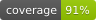

## Overview



This is a simple POC that mirrors ocp release, operator and additional images from a mirror registry to disk 
and from disk to remote mirror registry

## POC 

This is still a WIP. It will use the head of the defaultChannel (for operators) and uses bundle filtering for specfic versions of operators.
For platform release a specifc version and platform architecture is used (refer to example/imagesetconfig.yaml)

**NB** To build graph images (OSUS) and rebuilding catalogs there is a dependency on Podman, i.e Podman should be installed on the os where this binary is used

## Usage

This assumes you have already installed Rust (refer to https://www.rust-lang.org/tools/install)

Clone this repo

Ensure that you have the correct permissions set in the $XDG_RUNTIME_DIR/containers/auth.json file

Execute the mirror to disk flow 

```bash

make build 

# use the catalog and release introspection tools to create a merged ImageSetConfig (this uses the example in this repo)
# refer to https://github.com/lmzuccarelli/rust-release-introspection-tool and https://github.com/lmzuccarelli/rust-catalog-introspection-tool for more details
kind: ImageSetConfiguration
apiVersion: mirror.openshift/v3alpha1
mirror:
  release: 
  - version: "4.14.16"
    image: "quay.io/openshift-release-dev/ocp-release:4.14.6-x86_64"
  operators:
  - catalog: "registry.redhat.io/redhat/redhat-operator-index:v4.14"
    packages:
    - name: aws-load-balancer-operator
      bundles: 
      - name: "aws-load-balancer-operator.v1.1.0"  

# execute 
./target/release/image-mirror --config imagesetconfig.yaml --loglevel info --destination file://test-mirror
```

Once the mirror to disk flow has been completed

You can tar.gz the <work-dir>/artifacts folder (or use as is) and transfer to removable media or scp etc to the air gapped environment. 

- If you have tar.gz'd the complete artifacts folder untar it before continuing
- If you have copied as is to removable media leave it as is.

The is no need to untar any file in the <work-dir>/artifacts folder the application will index the contents without untarring.

Execute the disk to mirror flow

```
# execute 
./target/release/image-mirror --loglevel info --from file://test-mirror/artifacts --destination docker://<remote quay.io registry>/init

```

## Notes

Only RedHat operator images have been tested i.e

- redhat-operator-index
- redhat-community-operator-index
- redhat-certified-operator-index

The disk to mirror flow has only been tested on **quay (onprem mirror-registry)**.

There are only 2 modes in filtering operators 
- Operator filtering uses defaultChannel head if no bundle name is specified.
- If a bundle name is used (there is no notion of channels,min and max versions), the exact bundle name will be filtered. This allows for more accurate filtering.

For extra tooling please refer to the following repo's

Release introspection tool - https://github.com/lmzuccarelli/rust-release-introspection-tool

Catalog introspection tool - https://github.com/lmzuccarelli/rust-catalog-introspection-tool

Catalog TUI viewer         - https://github.com/lmzuccarelli/rust-operator-catalog-viewer

As mentioned this is still very much a WIP, so PR's and suggestions are welcome.

## Testing & Debugging

Refer to the [debug readme](DEBUG.md) document
