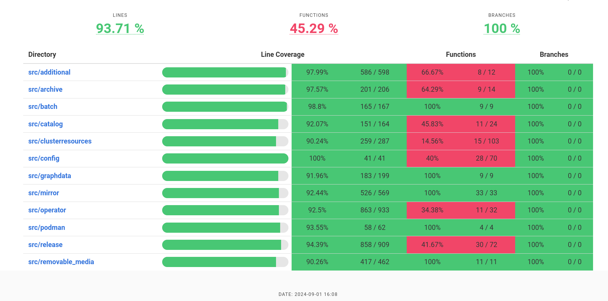

## Overview


This is a simple POC that mirrors ocp release, operator and additional images from a registry to disk 
and from disk to mirror

## POC 

This is still a WIP. It will use the head of the defaultChannel (for operators) and uses bundle filtering for specfic versions of operators.
For platform release a specifc version and platform architecture is used (refer to example/imagesetconfig.yaml)

**NB** To buid graph images (OSUS) and rebuilding catalogs there is a dependency on Podman, i.e Podman should be installed on the os where this binary is used

## Usage

This assumes you have already installed Rust (refer to https://www.rust-lang.org/tools/install)

Clone this repo

Ensure that you have the correct permissions set in the $XDG_RUNTIME_DIR/containers/auth.json file

Execute the following to copy to local disk 

```bash

make build 

# use the catalog and release introspection tools to create a merged ImageSetConfig (this uses the example in this repo)
# refer to https://github.com/lmzuccarelli/rust-release-introspection-tool and https://github.com/lmzuccarelli/rust-catalog-introspection-tool for more details
kind: ImageSetConfiguration
apiVersion: mirror.openshift/v3alpha1
mirror:
  release: 
  - version: "4.14.16"
    image: "quay.io/openshift-release-dev/ocp-release:4.14.6-x86_64"
  operators:
  - catalog: "registry.redhat.io/redhat/redhat-operator-index:v4.14"
    packages:
    - name: aws-load-balancer-operator
      bundles: 
      - name: "aws-load-balancer-operator.v1.1.0"  

# execute 
./target/release/image-mirror --config imagesetconfig.yaml --loglevel info 
```

## Notes

Only RedHat operator images have been tested i.e

- redhat-operator-index
- redhat-community-operator-index
- redhat-certified-operator-index

Operator filtering uses defaultChannel if no bundle name is specified.
Only bundle name filtering is used (no channels,min and max versions) - this allows for more accurate filtering

For extra tooling please refer to the following repo's

Release introspection tool - https://github.com/lmzuccarelli/rust-release-introspection-tool

Catalog introspection tool - https://github.com/lmzuccarelli/rust-catalog-introspection-tool

Catalog TUI viewer         - https://github.com/lmzuccarelli/rust-operator-catalog-viewer


## Testing & Debugging

Ensure grcov and  llvm tools-preview are installed

```
cargo install grcov 

rustup component add llvm-tools-preview

```

execute the tests

```
# add the -- --nocapture or --show-ouput flags to see println! statements
$ CARGO_INCREMENTAL=0 RUSTFLAGS='-Cinstrument-coverage' LLVM_PROFILE_FILE='cargo-test-%p-%m.profraw' cargo test

# for individual tests
$ CARGO_INCREMENTAL=0 RUSTFLAGS='-Cinstrument-coverage' LLVM_PROFILE_FILE='cargo-test-%p-%m.profraw' cargo test create_diff_tar_pass -- --show-output
```

check the code coverage

```
$ grcov . --binary-path ./target/debug/deps/ -s . -t html --branch --ignore-not-existing --ignore '../*' --ignore "/*" --ignore "src/main.rs" -o target/coverage/html

```

To Debug

execute the correct make

```
make build-debug

# launch rust-gdb

rust-gdb --args target/debug/image-mirror --config imagesetconfig.yaml  --loglevel info

# set breakpoint
b src/release/collector.rs:461

# execute run
r

# step
n

# print
p img.name
```

### Coverage Overview



